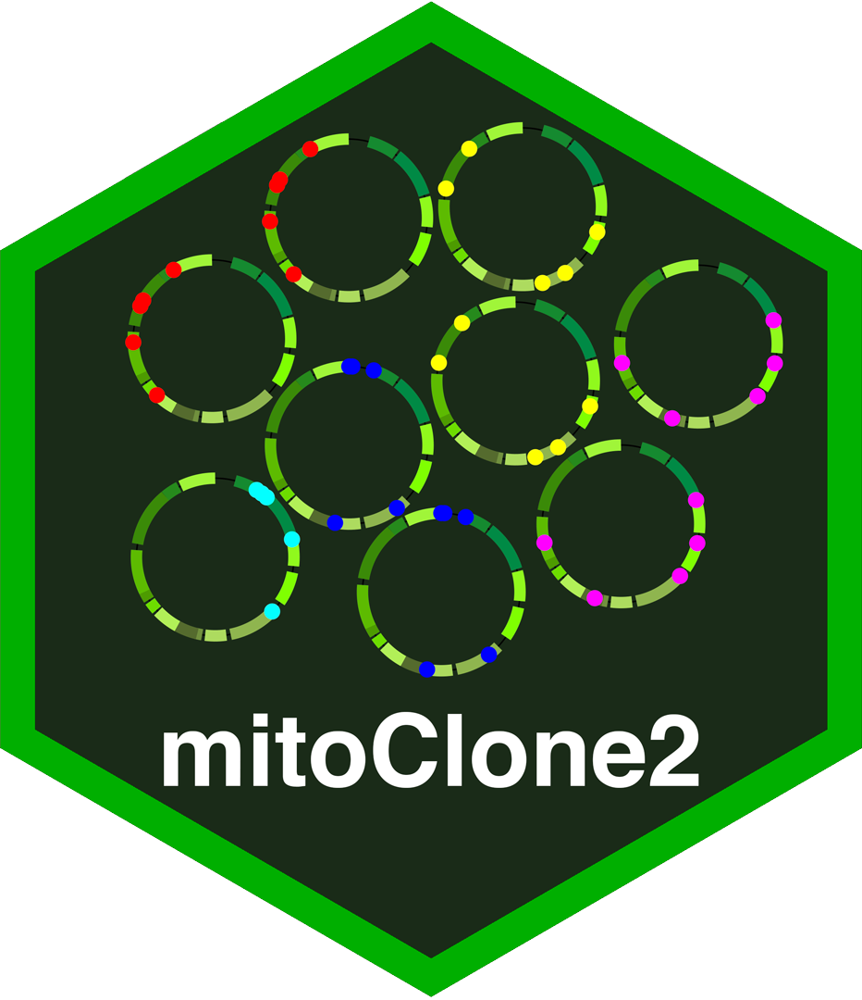

# mitoClone2 

The R package is used for performing the analysis of clonal heterogeneity based on nuclear and mitochondrial mutations in single cell RNA or DNA sequencing. It is a new and improved version of the package, mitoClone, originally described by [Velten et al. (2021)](https://www.nature.com/articles/s41467-021-21650-1).

## 1. System Requirements:
   - Linux/Mac
   - R 4.0+
   - SCITE/PhISCS
   - Python 2.7, 3.6, or 3.7 (optional)
   - Gurobi 9.0.0+ (optional)
   
Importantly, depending on the user's need for tree-building, an installation of PhiSCS may be necessary. For SCITE, the program should be installed automatically when the mitoClone2 package is installed. Please read the manual provided by the software authors [SCITE Installation Instructions](https://github.com/cbg-ethz/SCITE) to better understand the software. In the latter case, both Gurobi and the gurobipy python package, [Gurobi Installation Instructions](https://www.gurobi.com/documentation/9.0/quickstart_mac/software_installation_guid.html) and [Instructions for Installing gurobipy](https://support.gurobi.com/hc/en-us/articles/360044290292-How-do-I-install-Gurobi-for-Python-]) are necessary. Gurobi is freely available for academic users see [the website](http://www.gurobi.com).

See **DESCRIPTION** file for specific R package requirements.

The software has been successfully implemented and tested using: Python 3.6.5, R 4.0.0, and Gurobi 9.0.3 on CentOS 7.

## 2. Installation
For manual package installation use the command:

``` r
## NOT WORKING
#if (!requireNamespace("BiocManager", quietly = TRUE))
#    install.packages("BiocManager")
#BiocManager::install('mitoClone2')
## use devtools to install
devtools::install_github("benstory/mitoClone2")

```

Estimated installation time: < 1 hour*

## 3. Demo

Please see R vignettes for further instructions and a demo using real data. Use the command `vignette("mitoClone2")` after loading the library (see Instructions) to list all available tutorials.

Estimated demo completion time: < 1 hour

## 4. Usage Instructions

After installing all dependencies, open an R session and load the library using the following command:

``` r
library(mitoClone2)
```

*Notes:*
Please make sure to set your environmental python variables correctly for use of gurobi. See for example the `python_env` parameter.

Again please view the R vignettes for usage possibilities.

   - **overview**: Instructions on how to filter mitochondrial mutations using either a list of sites to be excluded or shared mutations across samples/patients (typical runtime: > 10 minutes)
   - **clustering**: Instructions on how to cluster mutations into a clonal hierarchy and how to assign cells to clones (typical runtime: < 1 hour)


